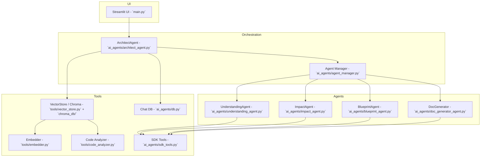

# Architecture Overview

This document provides a high-level architecture diagram and component descriptions for the project.

## Component descriptions

- **Streamlit UI (`main.py`)**: Provides user-facing interface. Sends user queries to the Architect agent and displays results and generated docs.

- **ArchitectAgent (`ai_agents/architect_agent.py`)**: Orchestrator. Detects intent, performs RAG retrieval via `sdk_tools.search_vector`, delegates to sub-agents, and persists chat results via `ai_agents.db.ChatDB`.

- **Agent Manager (`ai_agents/agent_manager.py`)**: Registers agents and wires handlers into a lightweight `crew` wrapper. Use this to add or replace handlers.

- **Domain Agents (`ai_agents/*_agent.py`)**: Implement `analyze` or `generate` methods for specific tasks (Understanding, Impact, Blueprint, Documentation).

- **Tools**:
  - `tools/embedder.py`: builds embeddings for code and text.
  - `tools/vector_store.py`: wraps the Chroma vector DB used for retrieval.
  - `tools/code_analyzer.py`: extracts metadata from code to improve retrieval quality.
  - `ai_agents/sdk_tools.py`: small wrappers used by agents (search_vector, detect_intent, memory helpers).
  - `ai_agents/db.py`: chat persistence layer (SQLite).

## How to extend

- Add a new agent implementation under `ai_agents/` exposing `analyze(query, context)` or `generate(query, context)` and register it in `ai_agents/agent_manager.py` using `create_agent(..., handler=YourAgent())`.

- Improve RAG by running `tools/embedder.py` to rebuild the vector index and confirm embeddings are stored under `chroma_db/`.

---

If you'd like, I can also produce a PNG/SVG of the diagram (requires Mermaid/PlantUML tooling); tell me which format you prefer and I will generate it.
