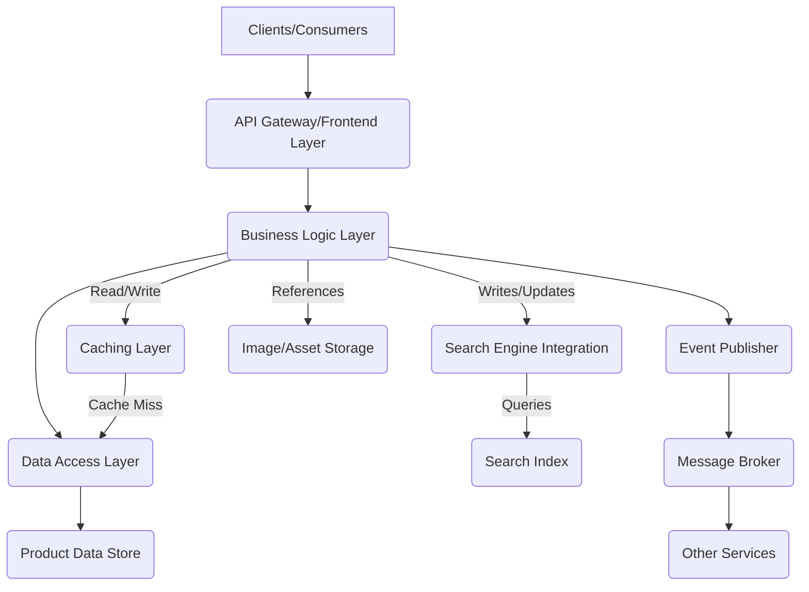
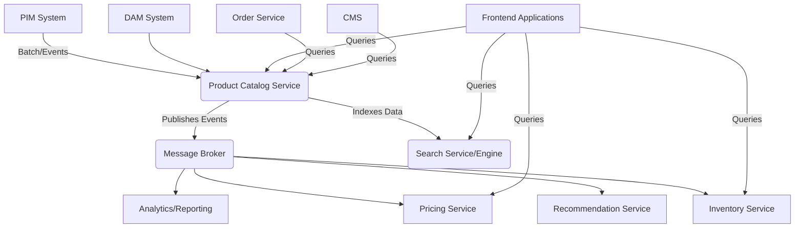

# Generated Documentation

As a Senior Solution Architect, I've prepared a comprehensive documentation for a **Product Catalog Service**. This service is fundamental for any e-commerce platform or system requiring detailed product information management.

---

# Product Catalog Service Documentation

## 1. Overview

The Product Catalog Service is a core component within an enterprise architecture, primarily responsible for centralizing, managing, and delivering comprehensive product information. It acts as the single source of truth for all product-related data, decoupling product details from other domain services like inventory, pricing, or order management. This separation allows for greater scalability, maintainability, and specialized handling of product data.

**Key Responsibilities:**
*   **Centralized Product Data:** Stores and manages all static and semi-static product attributes (e.g., name, description, SKU, categories, images, specifications).
*   **Product Discovery:** Facilitates efficient searching, filtering, and browsing of products.
*   **Data Consistency:** Ensures consistent product information across various consuming applications.
*   **Scalability & Performance:** Designed to handle high volumes of read requests for product information, often employing caching strategies.

**Target Audience:**
*   Frontend applications (e.g., Web UI, Mobile Apps)
*   Backend services (e.g., Order Service, Recommendation Service, Inventory Service)
*   Marketing and merchandising tools
*   Reporting and analytics systems

## 2. Components or Modules

A typical Product Catalog Service is comprised of several logical components to handle data ingestion, storage, retrieval, and exposure.

*   **API Gateway/Frontend Layer:** Exposes RESTful or gRPC endpoints for external and internal consumers to interact with the service. Handles request validation, authentication, and authorization.
*   **Business Logic Layer:** Contains the core business rules for product management. This includes data transformation, validation, aggregation, and orchestrating interactions with the data access layer.
*   **Data Access Layer (DAL):** Manages interactions with the underlying product data store. Abstracts the persistence logic from the business logic.
*   **Product Data Store:** The primary database where product information is persisted. This could be a relational database (e.g., PostgreSQL, MySQL) for structured data, a NoSQL database (e.g., MongoDB, Cassandra) for flexible schemas, or a combination.
*   **Search Engine Integration:** An integrated search engine (e.g., Elasticsearch, Apache Solr) for fast, full-text search capabilities, faceting, and advanced filtering. Product data is often indexed here for quick retrieval.
*   **Image/Asset Storage:** While product metadata resides in the primary data store, large binary assets like product images and videos are typically stored in an object storage solution (e.g., AWS S3, Google Cloud Storage, Azure Blob Storage) and referenced by URLs in the product data.
*   **Caching Layer:** A distributed cache (e.g., Redis, Memcached) to store frequently accessed product data, significantly reducing database load and improving response times for read-heavy operations.
*   **Event Publisher:** Publishes events (e.g., `ProductCreated`, `ProductUpdated`, `ProductDeleted`) to a message broker to notify other services about changes in the product catalog.



## 3. APIs or Interfaces

The Product Catalog Service typically exposes a RESTful API for managing and querying product information.

**Base URL:** `/products` (example)

### Product Management APIs (Internal/Admin)

These APIs are usually protected and used by backend systems or administrative UIs.

*   **Create Product:**
    *   `POST /products`
    *   **Request Body:** `Product` object (JSON)
    *   **Response:** `201 Created`, `Product` object with generated ID.
*   **Get Product by ID:**
    *   `GET /products/{productId}`
    *   **Response:** `200 OK`, `Product` object. `404 Not Found` if product doesn't exist.
*   **Update Product:**
    *   `PUT /products/{productId}`
    *   **Request Body:** `Product` object (JSON)
    *   **Response:** `200 OK`, updated `Product` object.
*   **Partially Update Product:**
    *   `PATCH /products/{productId}`
    *   **Request Body:** Partial `Product` object (JSON)
    *   **Response:** `200 OK`, updated `Product` object.
*   **Delete Product:**
    *   `DELETE /products/{productId}`
    *   **Response:** `204 No Content`.

### Product Query APIs (Public/Consumer)

These APIs are optimized for read-heavy operations and often publicly accessible (with appropriate rate limiting and security).

*   **Get All Products (Paginated):**
    *   `GET /products?page={page}&size={size}`
    *   **Response:** `200 OK`, list of `Product` objects, plus pagination metadata.
*   **Search Products:**
    *   `GET /products/search?q={query}&category={categoryId}&brand={brandId}&minPrice={min}&maxPrice={max}&sort={field}&order={asc/desc}&page={page}&size={size}`
    *   **Response:** `200 OK`, list of `Product` objects, aggregated facets, and pagination metadata.
*   **Get Products by Category:**
    *   `GET /categories/{categoryId}/products?page={page}&size={size}`
    *   **Response:** `200 OK`, list of `Product` objects belonging to the specified category.
*   **Get Product Attributes/Specifications:**
    *   `GET /products/{productId}/attributes`
    *   **Response:** `200 OK`, list of key-value pairs for product specifications.

**Example Product Object (JSON Schema Snippet):**

```json
{
  "productId": "UUID",
  "sku": "string",
  "name": "string",
  "description": "string",
  "shortDescription": "string",
  "brand": {
    "brandId": "UUID",
    "name": "string"
  },
  "categories": [
    {
      "categoryId": "UUID",
      "name": "string"
    }
  ],
  "images": [
    {
      "url": "string (URL to asset storage)",
      "altText": "string",
      "isPrimary": "boolean"
    }
  ],
  "attributes": [
    {
      "name": "string",
      "value": "string"
    }
  ],
  "status": "ENUM (ACTIVE, INACTIVE, DRAFT)",
  "createdAt": "datetime",
  "updatedAt": "datetime"
}
```

## 4. Dependencies / Integrations

The Product Catalog Service typically integrates with various other systems within an enterprise ecosystem.

*   **Product Information Management (PIM) System:**
    *   **Purpose:** The PIM system is often the master system for creating and enriching product data.
    *   **Integration:** The Product Catalog Service usually consumes product data from the PIM system, either through scheduled batch imports, real-time API calls, or event-driven updates (e.g., PIM publishes `ProductUpdated` events to a message broker, which the Product Catalog Service consumes).
*   **Digital Asset Management (DAM) System:**
    *   **Purpose:** Manages product images, videos, and other digital assets.
    *   **Integration:** The Product Catalog Service stores references (URLs) to assets managed by the DAM. When a product is updated, it might fetch updated URLs from the DAM or receive notifications.
*   **Inventory Service:**
    *   **Purpose:** Manages product stock levels and availability.
    *   **Integration:** The Product Catalog Service does *not* store inventory. When displaying products, a frontend application might query the Product Catalog Service for product details and then the Inventory Service for real-time stock information, or the Product Catalog Service might enrich its response with current stock levels by calling the Inventory Service.
*   **Pricing Service:**
    *   **Purpose:** Manages product pricing, including promotions, discounts, and regional variations.
    *   **Integration:** Similar to inventory, the Product Catalog Service does *not* store pricing. Frontend applications query the Pricing Service alongside the Product Catalog Service.
*   **Search Service (External):**
    *   **Purpose:** Provides advanced search capabilities (if not integrated internally).
    *   **Integration:** The Product Catalog Service pushes product data to an external search index. Consumers then query the external search service directly for product discovery.
*   **Recommendation Service:**
    *   **Purpose:** Provides personalized product recommendations.
    *   **Integration:** The Recommendation Service consumes product data (often via events from the Product Catalog Service) to build its models and link recommendations back to actual product IDs.
*   **Order Service:**
    *   **Purpose:** Handles customer orders.
    *   **Integration:** During order creation, the Order Service retrieves definitive product details (like SKU, name, image, exact attributes) from the Product Catalog Service to ensure order accuracy and historical context.
*   **Content Management System (CMS):**
    *   **Purpose:** Manages rich content like product reviews, blog posts, or marketing materials related to products.
    *   **Integration:** A CMS might link to products using their IDs, pulling basic product information from the Product Catalog Service.
*   **Analytics & Reporting Systems:**
    *   **Purpose:** Collects data for business intelligence and reporting.
    *   **Integration:** These systems consume product data, often via events or periodic data exports, to analyze product performance, sales trends, etc.
*   **Message Broker (e.g., Kafka, RabbitMQ):**
    *   **Purpose:** Facilitates asynchronous communication and decoupling between services.
    *   **Integration:** The Product Catalog Service publishes events (e.g., `ProductCreated`, `ProductUpdated`) to the message broker, and may also subscribe to events from PIM or other upstream systems.



## 5. Example / Usage

Consider an e-commerce website where a user wants to view a product, add it to their cart, and see related items.

1.  **User Browses Categories/Searches:**
    *   The **Frontend Application** sends a `GET /products/search?q=laptop&category=electronics&page=1&size=20` request to the **Product Catalog Service**.
    *   The **Product Catalog Service** queries its internal **Search Engine Integration** (e.g., Elasticsearch).
    *   It retrieves a list of matching `Product` objects (ID, name, short description, primary image URL).
    *   The **Frontend Application** displays the search results.

2.  **User Clicks on a Product:**
    *   The **Frontend Application** sends a `GET /products/{productId}` request to the **Product Catalog Service** for the selected product.
    *   The **Product Catalog Service** retrieves the full `Product` details from its **Product Data Store** (potentially from the **Caching Layer** first).
    *   In parallel, the **Frontend Application** sends:
        *   `GET /inventory/{productId}` to the **Inventory Service** to check stock.
        *   `GET /pricing/{productId}` to the **Pricing Service** to get the current price and any applicable discounts.
        *   `GET /recommendations/related/{productId}` to the **Recommendation Service** for similar products.
    *   The **Frontend Application** aggregates all this information and renders the detailed product page (product description, images, specifications, price, availability, recommended products).

3.  **User Adds Product to Cart:**
    *   The **Frontend Application** sends a request to the **Cart Service** to add the product.
    *   The **Cart Service** might internally validate the `productId` by making a quick `GET /products/{productId}` call to the **Product Catalog Service** to ensure the product exists and is active, before adding it to the cart.

## 6. Recommendations

As a Solution Architect, I emphasize the following best practices for designing and operating a Product Catalog Service:

*   **API Design:**
    *   Adhere to RESTful principles for clear, predictable, and maintainable APIs.
    *   Use clear, consistent naming conventions.
    *   Implement pagination, filtering, and sorting for all list and search endpoints.
    *   Version your APIs (e.g., `/v1/products`).
*   **Data Model Flexibility:**
    *   Design the data model to be extensible, especially for product attributes, to accommodate new product types without frequent schema changes. Consider using NoSQL for attributes or a flexible JSONB column in a relational database.
*   **Performance & Scalability:**
    *   **Caching:** Implement aggressive caching for read-heavy operations (e.g., Redis for product details, CDN for images).
    *   **Indexing:** Ensure proper database indexing for frequently queried fields. Utilize a dedicated search engine (Elasticsearch, Solr) for complex search and filtering.
    *   **Read Replicas:** Use database read replicas to distribute read load.
    *   **Microservices Principle:** Keep the service focused solely on product catalog responsibilities, avoiding scope creep into inventory or pricing.
*   **Event-Driven Architecture:**
    *   Publish product change events (e.g., `ProductCreated`, `ProductUpdated`, `ProductDeleted`) to a message broker. This allows other services to react to changes asynchronously, promoting loose coupling and real-time data synchronization.
*   **Data Ingestion Strategy:**
    *   Determine a robust strategy for ingesting data from upstream systems (e.g., PIM). This could involve batch processing for initial loads, and real-time event-driven updates for subsequent changes. Implement idempotency and error handling for ingestion.
*   **Security:**
    *   Implement robust authentication and authorization for all API endpoints. Different endpoints might require different levels of access (e.g., admin APIs versus public read APIs).
    *   Encrypt data at rest and in transit.
*   **Observability:**
    *   **Logging:** Implement structured logging for all service operations, including requests, responses, and errors.
    *   **Monitoring:** Set up comprehensive monitoring for service health, performance metrics (latency, error rates, throughput), and resource utilization.
    *   **Alerting:** Configure alerts for critical issues (e.g., high error rates, service downtime).
    *   **Tracing:** Utilize distributed tracing to understand request flows across integrated services.
*   **Resilience:**
    *   Implement circuit breakers and retries when calling external services (e.g., Inventory, Pricing) to prevent cascading failures.
    *   Design for high availability with redundant instances and data replication.
*   **Documentation:**
    *   Maintain up-to-date API documentation (e.g., OpenAPI/Swagger) for easy consumption by client developers.