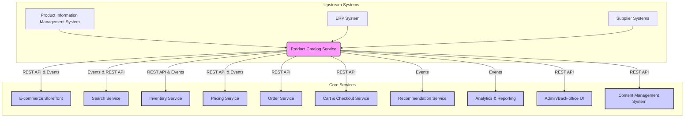

# Generated Documentation

This document provides a comprehensive overview of the **Product Catalog Service**, detailing its purpose, architecture, integrations, and operational considerations within a microservices ecosystem.

---

# Product Catalog Service Documentation

## 1. Overview

The **Product Catalog Service** is a core foundational service responsible for storing, managing, and delivering all essential product information across the system. It acts as the single source of truth for product-related data, enabling various other services and user interfaces to access consistent and up-to-date product details.

**Key Responsibilities:**
*   **Product Data Storage:** Persisting a comprehensive set of product attributes.
*   **Product Information Retrieval:** Providing APIs for querying product details.
*   **Product Organization:** Managing product categories, collections, and relationships.
*   **Variant Management:** Handling different options (e.g., size, color) for a single product.
*   **Attribute Management:** Defining and associating custom attributes with products.

**Benefits:**
*   **Centralized Data:** Eliminates data duplication and ensures consistency across all applications.
*   **Scalability:** Designed for high read throughput, supporting numerous concurrent requests from various consumers.
*   **Flexibility:** Supports diverse product types, complex attribute structures, and hierarchical categories.
*   **Decoupling:** Enables other services to operate independently without directly accessing the product database.

## 2. Components or Modules

The Product Catalog Service is logically divided into several functional modules:

*   **Product Core Management:**
    *   Handles the creation, retrieval, updating, and deletion (CRUD) of core product entities.
    *   Stores fundamental attributes such as SKU, name, description, brand, images, and status.
*   **Category & Taxonomy Management:**
    *   Manages the hierarchical structure of product categories.
    *   Allows products to be associated with one or more categories.
    *   Supports custom taxonomies and product collections.
*   **Attribute & Specification Management:**
    *   Defines and manages a flexible schema for product attributes (e.g., color, material, weight, technical specifications).
    *   Enables dynamic attribute sets for different product types.
*   **Variant Management:**
    *   Manages product variations based on specific attributes (e.g., a "T-shirt" product might have "red, small", "blue, medium" as variants).
    *   Each variant often has its own SKU, image, and potentially unique attributes.
*   **Data Persistence Layer:**
    *   The underlying database (e.g., PostgreSQL, MongoDB, Cassandra) responsible for durable storage of all product data.
    *   May include an ORM/ODM layer for data access.
*   **Caching Layer:**
    *   An in-memory cache (e.g., Redis, Memcached) to store frequently accessed product data, reducing database load and improving response times.
*   **Event Publisher:**
    *   A module responsible for emitting events to a message broker whenever product data changes (e.g., `ProductCreated`, `ProductUpdated`, `ProductDeleted`). This is crucial for enabling real-time synchronization with other services.

## 3. APIs or Interfaces

The Product Catalog Service exposes a set of RESTful APIs for data manipulation and retrieval, along with an event-driven interface for reactive integration.

### 3.1 RESTful API Endpoints

The primary interface is a RESTful API, typically providing JSON-formatted responses.

| Method | Endpoint                    | Description                                       |
| :----- | :-------------------------- | :------------------------------------------------ |
| `GET`  | `/products`                 | Retrieves a paginated list of all products. Supports filters (e.g., by category, status, brand). |
| `GET`  | `/products/{id}`            | Retrieves a single product by its unique identifier. |
| `POST` | `/products`                 | Creates a new product.                              |
| `PUT`  | `/products/{id}`            | Updates an existing product by its ID.              |
| `DELETE`|`/products/{id}`            | Deletes a product by its ID.                        |
| `GET`  | `/products/{id}/variants`   | Retrieves all variants for a specific product.      |
| `GET`  | `/products/{id}/attributes` | Retrieves all custom attributes for a specific product. |
| `GET`  | `/categories`               | Retrieves a list of all product categories, often in a tree structure. |
| `GET`  | `/categories/{id}`          | Retrieves a single category by its ID.              |
| `POST` | `/categories`               | Creates a new category.                             |
| `PUT`  | `/categories/{id}`          | Updates an existing category.                       |
| `DELETE`|`/categories/{id}`          | Deletes a category.                                 |

**Example Request (Get Product Details):**
```http
GET /products/PROD-XYZ-789
Accept: application/json
```

**Example Response:**
```json
{
  "id": "PROD-XYZ-789",
  "sku": "TSHIRT-BLUE-L",
  "name": "Classic Cotton T-Shirt",
  "description": "A comfortable and stylish t-shirt made from 100% organic cotton.",
  "brand": "EcoWear",
  "status": "active",
  "images": [
    "https://example.com/images/ts-blue-l-front.jpg",
    "https://example.com/images/ts-blue-l-back.jpg"
  ],
  "categories": [
    {"id": "CAT-CLOTHING", "name": "Clothing"},
    {"id": "CAT-TOPS", "name": "Tops"}
  ],
  "variants": [
    {"sku": "TSHIRT-BLUE-S", "size": "S", "color": "Blue"},
    {"sku": "TSHIRT-BLUE-M", "size": "M", "color": "Blue"},
    {"sku": "TSHIRT-BLUE-L", "size": "L", "color": "Blue"}
  ],
  "attributes": {
    "material": "100% Organic Cotton",
    "washCare": "Machine wash cold",
    "weightKg": 0.2
  },
  "lastUpdated": "2023-10-27T10:00:00Z"
}
```

### 3.2 Event-Driven Interfaces

The Product Catalog Service publishes events to a message broker (e.g., Apache Kafka, RabbitMQ) for critical data changes, enabling other services to react in real-time.

**Common Event Types:**
*   `ProductCreated`: Fired when a new product is added.
*   `ProductUpdated`: Fired when an existing product's details change.
*   `ProductDeleted`: Fired when a product is removed.
*   `CategoryUpdated`: Fired when a category's details or hierarchy change.

These events typically contain the ID of the affected entity and potentially a subset or full representation of the changed data.

## 4. Dependencies / Integrations

The Product Catalog Service sits at the heart of an e-commerce ecosystem, integrating with numerous upstream (data providers) and downstream (data consumers) services.

### 4.1 Upstream Integrations (Data Providers)

*   **Product Information Management (PIM) System:**
    *   **Integration Type:** Asynchronous (event-driven or batch processing). PIM is often the master system for rich product content and complex attribute definitions.
    *   **Purpose:** The PIM pushes product updates, new product introductions, and category changes to the Product Catalog Service. This ensures the service reflects the latest marketing and product specifications.
*   **Enterprise Resource Planning (ERP) System:**
    *   **Integration Type:** Asynchronous (batch processing or scheduled sync).
    *   **Purpose:** Provides core logistical data such as base product SKUs, initial descriptions, cost prices, and sometimes basic product categorization.
*   **Supplier/Vendor Systems:**
    *   **Integration Type:** Asynchronous (API calls, FTP file transfers, webhooks).
    *   **Purpose:** In some models, suppliers might directly update product data, especially for marketplaces or dropshipping models.

### 4.2 Downstream Integrations (Data Consumers)

*   **E-commerce Storefront / Frontend:**
    *   **Integration Type:** Synchronous (REST API calls).
    *   **Purpose:** Displays product names, descriptions, images, categories, and specifications to end-users on product listing pages, product detail pages, and search results.
*   **Search Service:**
    *   **Integration Type:** Asynchronous (consumes `ProductUpdated` events).
    *   **Purpose:** Indexes product data (SKUs, names, descriptions, categories, attributes) to provide fast and relevant search capabilities to users.
*   **Inventory Service:**
    *   **Integration Type:** Synchronous (REST API calls for product existence checks) or Asynchronous (consumes `ProductCreated/Updated` events for product onboarding).
    *   **Purpose:** Needs product IDs and SKUs to track stock levels accurately. The Product Catalog Service provides the canonical product identifiers.
*   **Pricing Service:**
    *   **Integration Type:** Synchronous (REST API calls for product existence checks) or Asynchronous (consumes `ProductCreated/Updated` events).
    *   **Purpose:** Requires product IDs and potentially attributes (e.g., color, size) to determine the correct price for a specific product variant, considering promotions or customer segments.
*   **Order Service:**
    *   **Integration Type:** Synchronous (REST API calls).
    *   **Purpose:** When an order is placed, the Order Service retrieves product details (e.g., name, SKU, image URL at the time of order) from the Product Catalog Service to store them with the order for historical reference.
*   **Cart & Checkout Service:**
    *   **Integration Type:** Synchronous (REST API calls).
    *   **Purpose:** Retrieves product information to display items in the user's shopping cart and during the checkout process.
*   **Recommendation Service:**
    *   **Integration Type:** Asynchronous (consumes `ProductUpdated` events, or batch data dumps).
    *   **Purpose:** Uses product attributes, categories, and relationships to generate personalized product recommendations.
*   **Content Management System (CMS):**
    *   **Integration Type:** Synchronous (REST API calls) or Asynchronous (webhooks/events).
    *   **Purpose:** May retrieve product data to enrich product pages with marketing content, articles, or guides that complement the core product information.
*   **Analytics & Reporting Service:**
    *   **Integration Type:** Asynchronous (consumes events or batch data exports).
    *   **Purpose:** Collects product data to generate reports on sales, product performance, category trends, etc.
*   **Admin/Back-office UI:**
    *   **Integration Type:** Synchronous (REST API calls).
    *   **Purpose:** Provides a user interface for administrators to manually create, edit, or delete product data.

### 4.3 Integration Diagram



## 5. Example / Usage Scenario

Consider a user browsing products on an e-commerce website:

1.  **Homepage / Category Page Load:**
    *   The `E-commerce Storefront` service makes a `GET /categories` call to the `Product Catalog Service` to display the main navigation categories.
    *   When the user selects a category (e.g., "Tops"), the `Storefront` makes a `GET /products?category=CAT-TOPS` call to the `Product Catalog Service` to fetch a list of products for that category.
    *   Alternatively, for search results, the `Storefront` might query the `Search Service` which has pre-indexed data from the `Product Catalog Service`.
2.  **Product Detail Page Load:**
    *   When the user clicks on a product (e.g., "Classic Cotton T-Shirt"), the `Storefront` makes a `GET /products/PROD-XYZ-789` call to the `Product Catalog Service` to retrieve all detailed information (name, description, images, attributes, variants).
    *   Simultaneously, the `Storefront` might call the `Inventory Service` (e.g., `GET /inventory?sku=TSHIRT-BLUE-L`) to check stock availability for the selected variant and the `Pricing Service` (e.g., `GET /prices?sku=TSHIRT-BLUE-L`) to display the current price.
3.  **Product Update by Admin:**
    *   An administrator uses the `Admin/Back-office UI` to update the description of "Classic Cotton T-Shirt".
    *   The `Admin UI` makes a `PUT /products/PROD-XYZ-789` call to the `Product Catalog Service`.
    *   Upon successful update, the `Product Catalog Service` persists the change and publishes a `ProductUpdated` event to the message broker.
    *   The `Search Service` consumes this `ProductUpdated` event and re-indexes the product, ensuring search results reflect the new description.
    *   The `Recommendation Service` also consumes the event, potentially updating its recommendation models.

## 6. Recommendations

### 6.1 Architectural Recommendations

*   **Read-Heavy Optimization:** Design for very high read throughput. Implement robust caching strategies (e.g., in-memory cache, CDN for images). Consider read replicas for the database.
*   **Eventual Consistency for Integrations:** While the Product Catalog Service itself maintains strong consistency for its data, other services consuming its events (e.g., Search Service) can operate on an eventually consistent model, which is often acceptable for real-time updates.
*   **Schema Flexibility:** Utilize a data model that can accommodate diverse product types and evolving attribute sets without requiring frequent schema migrations (e.g., document-oriented database for attributes or EAV model in relational databases).
*   **API Versioning:** Implement API versioning (e.g., `/v1/products`) to allow for backward-compatible changes and easier evolution of the service.

### 6.2 Operational Recommendations

*   **Monitoring and Alerting:** Implement comprehensive monitoring for API response times, error rates, database performance, and cache hit ratios. Set up alerts for critical thresholds.
*   **Logging and Tracing:** Utilize structured logging and distributed tracing (e.g., OpenTelemetry) to effectively debug issues across service boundaries.
*   **Security:** Implement API authentication (e.g., OAuth2, API Keys) and authorization (role-based access control) for all API endpoints. Ensure data at rest and in transit is encrypted.
*   **Disaster Recovery & Backup:** Regularly back up product data and have a clear disaster recovery plan in place.
*   **Performance Testing:** Conduct regular load and stress tests to ensure the service can handle peak traffic.

### 6.3 Future Enhancements

*   **Product Versioning:** Implement a mechanism to track changes to products over time, allowing for historical views or scheduled future price/description updates.
*   **Internationalization (i18n):** Support for multiple languages and locales for product names, descriptions, and attributes.
*   **Product Relations:** Ability to define and query complex relationships between products (e.g., "related products", "accessories", "bundles").
*   **Moderation Workflow:** For user-generated product content or complex approval processes, integrate with a moderation service.