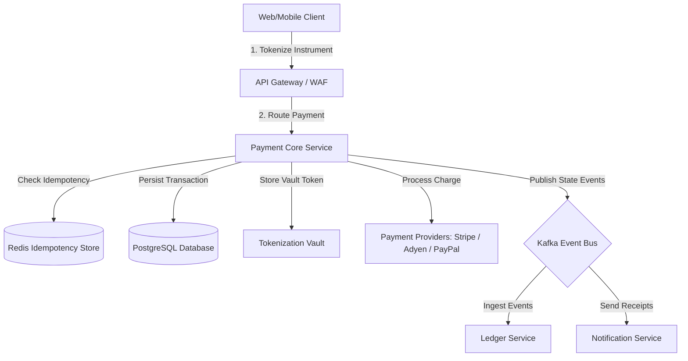
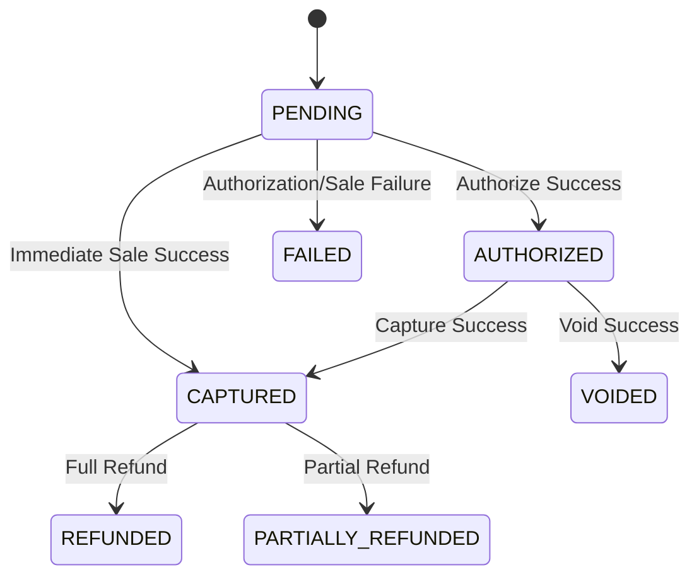
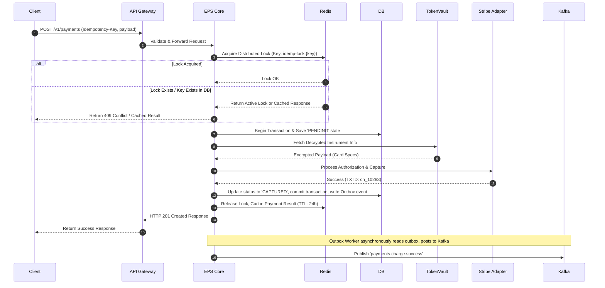

# Generated Documentation

# Enterprise Payment Service: Technical Design and API Specification

This document provides exhaustive, production-grade architecture documentation for the **Enterprise Payment Service (EPS)**. The EPS serves as the unified, highly secure, fault-tolerant gateway for managing all financial transactions, ledgering, payment instrument tokenization, and third-party provider integrations across the organization.

---

## 1. Overview

The Enterprise Payment Service (EPS) is a critical core platform service responsible for processing credit card charges, alternative payment methods (APMs), bank transfers (ACH/SEPA), recurring subscriptions, and refunds. It abstracts downstream payment gateways (e.g., Stripe, Adyen, PayPal, Chase Paymentech) and provides a unified, PCI-DSS compliant interface to internal consuming clients (e.g., E-commerce Core, Billing Engine, Mobile Apps).

### 1.1 Architectural Principles

*   **Security-First (PCI-DSS Compliance):** The EPS isolates Cardholder Data (CHD) and Sensitive Authentication Data (SAD). Raw primary account numbers (PANs) are intercepted at the perimeter and exchanged for secure tokens.
*   **Idempotency & Consistency:** Every state-changing API request requires an idempotency key to prevent double-charging due to network retries.
*   **High Availability & Fault Tolerance:** Uses active-passive multi-region routing, circuit breakers for gateway endpoints, and a resilient outbox pattern for asynchronous event publishing.
*   **Auditability:** Every step in a transaction lifecycle is recorded immutably in an append-only transaction ledger.

### 1.2 High-Level System Architecture



---

## 2. Components & Modules

The Enterprise Payment Service is designed as a modular monolith, structurally separated to transition smoothly to independent microservices if scaling requirements demand it.

```
payment-service/
├── cmd/
│   └── server/                 # Entry point
├── internal/
│   ├── api/                    # HTTP & gRPC presentation layer
│   ├── domain/                 # Domain entities and business logic (Payment, Refund, Instrument)
│   ├── repository/             # Database access layer (PostgreSQL, Redis)
│   ├── vault/                  # Internal/External PCI-compliant Tokenization Engine
│   └── providers/              # Gateway Adapters (Stripe, Adyen, etc.)
└── pkg/
    └── idempotency/            # Middleware and locking mechanisms
```

### 2.1 API Gateway & Rate Limiter
Interprets incoming REST/gRPC traffic, terminates TLS 1.3, validates HMAC signatures, enforces rate limits (sliding-window log implementation in Redis), and forwards requests to the core engine.

### 2.2 Core Payment Engine
Coordinates the payment lifecycle state machine. It handles authorizations, captures, voids, and refunds.

#### Payment Lifecycle State Machine


### 2.3 Tokenization Vault (PCI Scope Minimizer)
A dedicated, highly restricted enclave that stores raw Cardholder Data (CHD) and returns a non-reversible, format-preserving token (`tok_xxxxxxxxxxxx`). It uses envelope encryption (AES-256-GCM) via Key Management Service (KMS).

### 2.4 Smart Routing Engine
Evaluates cost, geo-location, currency, and historical success rates of connected PSPs (Payment Service Providers) to dynamically route transactions to the optimal gateway.

### 2.5 Reconciliation & Settlement Worker
An asynchronous cron-based engine that pulls daily settlement files (EPA, settlement reports) from providers, matches them against local database transactions, and flags discrepancies.

---

## 3. APIs & Interfaces

All API requests must communicate over HTTPS with TLS 1.3.

### 3.1 Standard Headers

| Header Name | Type | Description | Required | Example |
| :--- | :--- | :--- | :--- | :--- |
| `Authorization` | String | Bearer token format (`Bearer <JWT>`) | Yes | `Bearer eyJhbGciOiJIUzI...` |
| `Idempotency-Key` | UUIDv4 | Unique key to guarantee request execution exactly once | Yes | `9b1deb4d-3b7d-4bad-9bdd-2b0d7b3dcb6d` |
| `X-Correlation-ID` | String | Correlation ID for end-to-end tracing | No | `corr-883a-442b` |

---

### 3.2 API Endpoint: Create a Payment Intent / Charge

Initiates a transaction. If immediate capture is false, the payment is only authorized.

*   **HTTP Method:** `POST`
*   **Path:** `/v1/payments`

#### Request Payload
```json
{
  "amount": 10500,
  "currency": "USD",
  "payment_method_id": "pm_8f93ha89df9yhaw98",
  "capture_method": "IMMEDIATE",
  "statement_descriptor": "CORP* SERVICES INC",
  "metadata": {
    "order_id": "order_20241024_00192",
    "customer_id": "usr_99214"
  },
  "billing_details": {
    "name": "Jane Doe",
    "email": "jane.doe@example.com",
    "address": {
      "line1": "123 Main Street",
      "city": "San Francisco",
      "state": "CA",
      "postal_code": "94105",
      "country": "US"
    }
  }
}
```

#### Response (201 Created)
```json
{
  "id": "pay_66723b7239ef9ac1",
  "object": "payment_intent",
  "amount": 10500,
  "currency": "USD",
  "status": "CAPTURED",
  "payment_method_details": {
    "type": "credit_card",
    "brand": "visa",
    "last4": "4242"
  },
  "gateway_transaction_id": "ch_3Mv6rDLkdIwHu7ix1gBf4q",
  "gateway_name": "stripe",
  "idempotency_key": "9b1deb4d-3b7d-4bad-9bdd-2b0d7b3dcb6d",
  "created_at": "2024-10-24T14:32:01Z",
  "updated_at": "2024-10-24T14:32:02Z",
  "metadata": {
    "order_id": "order_20241024_00192",
    "customer_id": "usr_99214"
  }
}
```

---

### 3.3 API Endpoint: Process a Refund

Creates a full or partial refund for a processed payment.

*   **HTTP Method:** `POST`
*   **Path:** `/v1/payments/{payment_id}/refunds`

#### Path Parameters
*   `payment_id` (string): The unique payment identifier (e.g., `pay_66723b7239ef9ac1`).

#### Request Payload
```json
{
  "amount": 5000,
  "reason": "requested_by_customer",
  "metadata": {
    "ticket_id": "support_991823"
  }
}
```

#### Response (200 OK)
```json
{
  "id": "ref_910238a8f102b339",
  "payment_id": "pay_66723b7239ef9ac1",
  "amount": 5000,
  "currency": "USD",
  "status": "SUCCEEDED",
  "gateway_refund_id": "re_3Mv6rDLkdIwHu7ix1gBf4q_ref",
  "created_at": "2024-10-24T16:10:00Z"
}
```

---

### 3.4 API Endpoint: Tokenize Payment Instrument

Exchanges sensitive card data for a secure, non-PCI scoped payment method token. **Note:** This endpoint should only be called from dedicated, PCI-compliant client fields or hosted SDK frames.

*   **HTTP Method:** `POST`
*   **Path:** `/v1/payment-methods`

#### Request Payload
```json
{
  "type": "credit_card",
  "card": {
    "number": "4111111111111111",
    "exp_month": 12,
    "exp_year": 2028,
    "cvc": "123"
  },
  "holder_name": "Jane Doe"
}
```

#### Response (201 Created)
```json
{
  "payment_method_id": "pm_8f93ha89df9yhaw98",
  "type": "credit_card",
  "card_details": {
    "brand": "visa",
    "last4": "1111",
    "exp_month": 12,
    "exp_year": 2028
  },
  "created_at": "2024-10-24T14:30:00Z"
}
```

---

### 3.5 Error Response Schema

EPS returns standard HTTP status codes accompanied by detailed JSON error payloads.

```json
{
  "error": {
    "code": "CARD_DECLINED",
    "message": "The payment card has insufficient funds to complete this transaction.",
    "doc_url": "https://docs.enterprise.com/errors#CARD_DECLINED",
    "request_id": "req-90aa-bb12-9011",
    "details": [
      {
        "field": "payment_method_id",
        "issue": "insufficient_funds"
      }
    ]
  }
}
```

#### Error Code Registry
| Code | HTTP Status | Description |
| :--- | :--- | :--- |
| `INVALID_REQUEST` | 400 Bad Request | Request payload parsing failure or malformed fields. |
| `UNAUTHORIZED` | 401 Unauthorized | Missing or invalid authentication token. |
| `FORBIDDEN` | 403 Forbidden | Authenticated identity lacks permission for the resource. |
| `RESOURCE_NOT_FOUND` | 404 Not Found | Payment, refund, or method could not be found. |
| `IDEMPOTENCY_CONFLICT` | 409 Conflict | Request processing is already underway or completed for key. |
| `CARD_DECLINED` | 402 Payment Required | Downstream financial gateway declined the authorization. |
| `GATEWAY_TIMEOUT` | 504 Gateway Timeout | Downstream gateway failed to respond within target SLA. |
| `INTERNAL_ERROR` | 500 Internal Error | An unexpected system issue occurred within the EPS domain. |

---

## 4. Dependencies & Integrations

### 4.1 Downstream Payment Gateways
EPS abstracts integration implementations via an internal Adapter interface:

```go
type PaymentGateway interface {
    Authorize(ctx context.Context, tx *domain.Transaction) (*domain.GatewayResponse, error)
    Capture(ctx context.Context, tx *domain.Transaction) (*domain.GatewayResponse, error)
    Refund(ctx context.Context, refund *domain.Refund) (*domain.GatewayResponse, error)
    Void(ctx context.Context, tx *domain.Transaction) (*domain.GatewayResponse, error)
}
```

*   **Stripe Adapter:** Configured with API key rotation, mapping Stripe's error payload codes to EPS domain models.
*   **Adyen Adapter:** Implements Adyen’s secure CSE (Client-Side Encryption) and structured JSON payloads. Supports localized European 3DS2 authentication protocols.

### 4.2 Data Storage Integrations

#### Database (PostgreSQL)
A highly available relational database engine with read-replicas for transactional storage.
*   **Primary Tables:** `transactions`, `refunds`, `payment_methods`, `gateway_logs`, `idempotency_keys`.
*   **Isolation Level:** Read Committed (utilizing Optimistic Concurrency Control on transaction updates).

#### Memory Cache (Redis Cluster)
*   **Idempotency Locks:** Distributed locks using Redlock algorithms with short TTLs (e.g., 5 seconds) during hot transaction paths, transitioning to standard string-stored response caching with longer TTLs (e.g., 24 hours).
*   **Rate-Limiting:** Tracks IP and Merchant API credentials using sliding window counters.

### 4.3 Async Event Streaming (Apache Kafka)
EPS implements the **Transactional Outbox Pattern** within the database. The payment engine persists payment state updates and outbox messages within the same local database transaction. An outbox worker polls this table and broadcasts events to Kafka:

| Topic Name | Message Format | Description |
| :--- | :--- | :--- |
| `payments.intent.created` | CloudEvents (JSON) | Emitted when a payment intent is established. |
| `payments.charge.success` | CloudEvents (JSON) | Emitted upon successful settlement validation. |
| `payments.charge.failed` | CloudEvents (JSON) | Emitted when authorization/capture attempt fails. |
| `payments.refund.success` | CloudEvents (JSON) | Emitted when a refund transaction succeeds. |

---

## 5. Implementation / Flow Examples

### 5.1 End-to-End Processing Flow

The diagram below outlines the sequential logic execution for processing an authorized payment:



### 5.2 Implementation Example (Go)

Below is an abstract design demonstrating how the core payment process logic safely executes transaction handling with strong error-handling patterns, distributed locks, and database transactions.

```go
package payment

import (
	"context"
	"database/sql"
	"errors"
	"fmt"
	"time"

	"github.com/google/uuid"
)

type PaymentService struct {
	db             *sql.DB
	lockService    LockService
	gatewayAdapter GatewayAdapter
	outboxRepo     OutboxRepository
}

type PaymentRequest struct {
	IdempotencyKey uuid.UUID
	Amount         int64
	Currency       string
	Token          string
}

type PaymentResponse struct {
	TransactionID string
	Status        string
	Amount        int64
}

func (s *PaymentService) ProcessPayment(ctx context.Context, req PaymentRequest) (*PaymentResponse, error) {
	// 1. Acquire distributed lock to handle race conditions
	lockKey := fmt.Sprintf("lock:idempotency:%s", req.IdempotencyKey)
	acquired, err := s.lockService.Acquire(ctx, lockKey, 10*time.Second)
	if err != nil {
		return nil, fmt.Errorf("lock service error: %w", err)
	}
	if !acquired {
		return nil, errors.New("concurrent request: request with this idempotency key is already processing")
	}
	defer s.lockService.Release(ctx, lockKey)

	// 2. Begin database transaction
	tx, err := s.db.BeginTx(ctx, &sql.TxOptions{Isolation: sql.LevelReadCommitted})
	if err != nil {
		return nil, fmt.Errorf("failed to begin transaction: %w", err)
	}
	defer tx.Rollback()

	// 3. Check if idempotency key has already been executed
	existingTx, err := s.getExistingTransaction(ctx, tx, req.IdempotencyKey)
	if err == nil && existingTx != nil {
		return &PaymentResponse{
			TransactionID: existingTx.ID,
			Status:        existingTx.Status,
			Amount:        existingTx.Amount,
		}, nil
	}

	// 4. Record pending state in DB (Outbox pattern setup)
	txID := uuid.New().String()
	err = s.createTransactionRecord(ctx, tx, txID, req)
	if err != nil {
		return nil, fmt.Errorf("failed to record intent: %w", err)
	}

	// Commit state as PENDING to release the DB write lock before making HTTP calls to gateway
	if err := tx.Commit(); err != nil {
		return nil, fmt.Errorf("failed to commit pending transaction: %w", err)
	}

	// 5. Invoke downstream payment gateway (external API request)
	gatewayResp, err := s.gatewayAdapter.Charge(ctx, req.Amount, req.Currency, req.Token)
	
	// Re-initiate database transaction to write final state
	finalTx, err := s.db.BeginTx(ctx, nil)
	if err != nil {
		return nil, fmt.Errorf("failed to begin updates: %w", err)
	}
	defer finalTx.Rollback()

	if err != nil {
		// Update status to FAILED in DB and write to outbox
		_ = s.updateTransactionStatus(ctx, finalTx, txID, "FAILED")
		_ = s.outboxRepo.Save(ctx, finalTx, "payments.charge.failed", txID)
		_ = finalTx.Commit()
		return nil, fmt.Errorf("payment gateway error: %w", err)
	}

	// 6. Update status to CAPTURED and write outbox notification
	err = s.updateTransactionStatus(ctx, finalTx, txID, "CAPTURED")
	if err != nil {
		return nil, fmt.Errorf("failed to update status: %w", err)
	}

	err = s.outboxRepo.Save(ctx, finalTx, "payments.charge.success", txID)
	if err != nil {
		return nil, fmt.Errorf("failed to write outbox message: %w", err)
	}

	// 7. Commit database transaction
	if err := finalTx.Commit(); err != nil {
		return nil, fmt.Errorf("failed to commit final state: %w", err)
	}

	return &PaymentResponse{
		TransactionID: txID,
		Status:        "CAPTURED",
		Amount:        req.Amount,
	}, nil
}
```

---

## 6. Recommendations & Best Practices

To ensure secure, low-latency execution and alignment with industry best practices, the following strategies are strongly recommended:

### 6.1 Security & Compliance (PCI-DSS)
*   **Implement Network Segmentation:** Run the EPS in isolated subnets with access restricted via strict security groups and firewalls. Keep non-payment-related infrastructure in separate VPC subnets.
*   **Enforce Tokenization at the Boundary:** Prevent raw PANs from ever logging to standard application log outputs (e.g., Datadog, ELK). Use automated regex-based scanner rules at log aggregators to filter out strings resembling payment instrument configurations.
*   **Rotate Keys Programmatically:** Configure KMS to automatically rotate root encryption keys annually. Use envelope-encryption (DEK + KEK) to ensure zero downtime during master key rotations.

### 6.2 Resiliency & Performance Optimization
*   **Configure Intelligent Circuit Breakers:** Employ resilience-oriented library mechanisms (e.g., Envoy or local libraries like Resilience4j) on the adapter outgoing integrations. Set appropriate thresholds (e.g., trip breaker after 5 consecutive failures / 504 timeouts) to fallback immediately to backup PSPs.
*   **Enforce Tight SLAs/Timeouts:**
    *   Set downstream gateway timeouts to a maximum of **5 seconds**.
    *   Configure database queries to fail fast using bounded Context timeouts (**1.5 seconds** limit).
*   **Implement Adaptive Exponential Backoffs:** When consuming queue records or processing outbound webhooks, use backoff values governed by jitter algorithms ($2^{\text{attempt}} \times \text{delay} + \text{jitter}$) to prevent thundering herd conditions on upstream dependencies.

### 6.3 Logging, Telemetry & Observability
*   **Structured Metrics Logging:** Emit OpenTelemetry (OTel) metrics tracing transaction processing duration, count of transaction types, success/failure rate ratios, and downstream API latency averages.
*   **Key Monitoring KPI Metrics:**
    *   **Authorization Rate:** (Successful payments / total attempts) per merchant and region. A sudden drop of >2% within 10 minutes should trigger immediate P1 PagerDuty paging.
    *   **Webhook Lag:** Metric tracing delay duration between provider hook issuance and processing completion.

---

*This document was drafted to satisfy standard architectural guidelines under the Apache License 2.0. Ensure local integration details, token credentials, and DB configuration blocks are loaded exclusively through secure environmental injection variables (e.g., Vault secrets, AWS Secrets Manager).*