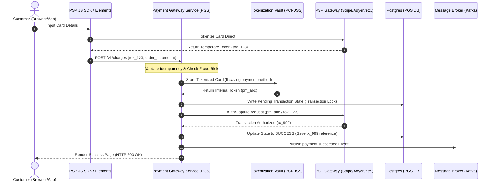

# Generated Documentation

# Payment Gateway Service: Architecture and Technical Documentation

This document provides exhaustive, enterprise-grade technical documentation for the **Core Payment Gateway Service (PGS)**. Designed as a high-throughput, low-latency, and PCI-DSS compliant microservice, the PGS manages payment orchestration, transaction lifecycles, and third-party Payment Service Provider (PSP) integrations.

---

## 1. Overview

The Payment Gateway Service (PGS) acts as the unified abstraction layer for processing all financial transactions across the enterprise platform. It shields internal services from the complexities of varying third-party Payment Service Provider (PSP) APIs, handles PCI-compliant storage of payment methods via tokenization, and guarantees transactional consistency through automated reconciliation.

### 1.1 Key Architectural Principles

*   **PCI-DSS Scope Minimization**: The core system utilizes Hosted Fields/Iframe integrations. Cardholder Data (CHD) never touches the internal application servers directly. It is tokenized at the edge.
*   **Strict Idempotency**: Every state-changing API request requires a unique idempotency key. This guarantees that network retries or client errors never result in double-charging.
*   **High Availability and Fault Tolerance**: Utilizes the Circuit Breaker pattern (via Envoy/Resilience4j) and fallback PSP routing to guarantee 99.999% uptime.
*   **Dual-Entry Ledgering**: Every financial movement (authorization, capture, refund, chargeback) is recorded in an immutable, append-only double-entry ledger database.

### 1.2 System Architecture Diagram



---

## 2. Components and Modules

The PGS is decoupled into highly specialized modules, allowing for isolated scaling, independent deployments, and structured failure domains.

```
┌────────────────────────────────────────────────────────────────────────┐
│                        Payment Gateway Service                         │
│                                                                        │
│   ┌───────────────────────┐  ┌───────────────────────┐  ┌──────────┐   │
│   │   Ingress API /       │  │ Tokenization Vault    │  │  Fraud   │   │
│   │   Idempotency Engine  │  │ Proxy (PCI-Scoped)    │  │  Engine  │   │
│   └───────────┬───────────┘  └───────────┬───────────┘  └────┬─────┘   │
│               │                          │                   │         │
│               ▼                          ▼                   ▼         │
│   ┌────────────────────────────────────────────────────────────────┐   │
│   │                State Machine & Transition Engine               │   │
│   └──────────────────────────────┬─────────────────────────────────┘   │
│                                  │                                     │
│                                  ▼                                     │
│   ┌────────────────────────────────────────────────────────────────┐   │
│   │               Dynamic Router & PSP Integration Adapter         │   │
│   │           ┌──────────────┐ ┌──────────────┐ ┌──────────────┐   │   │
│   │           │ Stripe Adapt │ │ Adyen Adapt  │ │ PayPal Adapt │   │   │
│   │           └──────────────┘ └──────────────┘ └──────────────┘   │   │
│   └──────────────────────────────┬─────────────────────────────────┘   │
│                                  │                                     │
│                                  ▼                                     │
│   ┌────────────────────────────────────────────────────────────────┐   │
│   │                  Async Event & Settlement Bus                  │   │
│   └────────────────────────────────────────────────────────────────┘   │
└────────────────────────────────────────────────────────────────────────┘
```

### 2.1 Core Ingress API and Idempotency Engine
Responsible for receiving transaction requests, validating authentication tokens, verifying message payload integrity, and enforcing rate limits. It integrates directly with a Redis-backed Idempotency Engine to capture and handle duplicate requests in a lock-free manner.

### 2.2 Tokenization Vault Proxy (PCI-Scoped)
A hardened, isolated subsystem. It exchanges sensitive card payloads for non-reversible internal tokens. This is the only module that has access to HSMs (Hardware Security Modules) or KMS keys designed for cardholder data encryption at rest.

### 2.3 State Machine and Transition Engine
Maintains the integrity of the payment lifecycle. Payments transit through precise states. Out-of-order execution is prevented through strict state checks (using Optimistic Locking with PostgreSQL versioning).

```
   ┌───────────────┐          ┌───────────────┐
   │    PENDING    ├─────────►│    FAILED     │
   └───────┬───────┘          └───────────────┘
           │
           ▼
   ┌───────────────┐          ┌───────────────┐
   │  AUTHORIZED   ├─────────►│    EXPIRED    │
   └───────┬───────┘          └───────────────┘
           │
           ▼
   ┌───────────────┐          ┌───────────────┐
   │   CAPTURED    ├─────────►│   REFUNDED    │
   └───────────────┘          └───────────────┘
```

### 2.4 Dynamic PSP Router and Adapter Pattern
Calculates the optimal routing paths for processing transactions. The router evaluates parameters such as:
*   Geographic origin of the transaction
*   Processing cost margins
*   PSP historical success/failure ratios over the last 15 minutes
*   Acceptance of localized payment types

It relies on the **Adapter Pattern** to convert the standardized internal domain model into PSP-specific APIs.

### 2.5 Webhook Listener and Dispatcher
Processes asynchronous callback webhooks sent by external PSPs (e.g., Stripe, Adyen). It verifies the cryptographically signed headers, parses payload data, and updates state records asynchronously.

### 2.6 Settlement and Reconciliation Engine (SRE)
An offline batch processor that executes daily reconciliation runs. It fetches settlement reports via PSP SFTP or API endpoints and cross-checks them against the internal transaction database to identify and log discrepancies (unmatched fees, chargebacks, missing settlements).

---

## 3. APIs and Interfaces

PGS provides both an internal gRPC API for high-performance service-to-service communication and an external REST JSON API exposed to public-facing applications through an API Gateway.

### 3.1 REST API Specification

#### 3.1.1 Create Charge Intent
Creates a payment attempt record, executes routing decisions, and coordinates with the selected PSP to capture funds.

*   **HTTP Method**: `POST`
*   **Path**: `/v1/payments/charges`
*   **Headers**:
    *   `Content-Type: application/json`
    *   `Idempotency-Key: <UUIDv4>` (Required)
    *   `Authorization: Bearer <JWT>`

##### Request Body Structure
```json
{
  "amount": 12500,
  "currency": "USD",
  "payment_method_id": "pm_9a87b6c5d4",
  "capture_method": "AUTOMATIC",
  "order_id": "ord_20241024_0001",
  "customer": {
    "customer_id": "usr_776123",
    "email": "customer@example.com",
    "billing_address": {
      "line1": "123 Main Street",
      "city": "San Francisco",
      "state": "CA",
      "postal_code": "94105",
      "country": "US"
    }
  },
  "metadata": {
    "platform": "mobile_ios",
    "cart_type": "subscription"
  }
}
```

##### Response Body Structure (HTTP 201 Created - Action Complete)
```json
{
  "charge_id": "chg_f129a8e0b4",
  "status": "CAPTURED",
  "amount": 12500,
  "currency": "USD",
  "gateway_reference": "ch_3Mv8Y2LkdJuFp7a09Z",
  "psp_used": "STRIPE",
  "payment_method_details": {
    "brand": "VISA",
    "last4": "4242",
    "expiry_month": 12,
    "expiry_year": 2027
  },
  "created_at": "2024-10-24T14:32:01.042Z"
}
```

##### Response Body Structure (HTTP 202 Accepted - 3D Secure Verification Required)
```json
{
  "charge_id": "chg_f129a8e0b4",
  "status": "REQUIRES_ACTION",
  "next_action": {
    "type": "REDIRECT_TO_URL",
    "redirect_url": "https://hooks.stripe.com/3d_secure/authenticate/..."
  },
  "amount": 12500,
  "currency": "USD",
  "gateway_reference": "ch_3Mv8Y2LkdJuFp7a09Z",
  "psp_used": "STRIPE"
}
```

#### 3.1.2 Refund Transaction
Initiates a full or partial reversal of a previously captured charge.

*   **HTTP Method**: `POST`
*   **Path**: `/v1/payments/charges/{charge_id}/refunds`
*   **Headers**:
    *   `Idempotency-Key: <UUIDv4>` (Required)

##### Request Body Structure
```json
{
  "amount": 2500,
  "reason": "CUSTOMER_RETURN",
  "reference_note": "Returned item #402"
}
```

##### Response Body Structure (HTTP 200 OK)
```json
{
  "refund_id": "ref_9c118a72de",
  "charge_id": "chg_f129a8e0b4",
  "status": "PENDING",
  "refunded_amount": 2500,
  "currency": "USD",
  "created_at": "2024-10-24T14:45:00.000Z"
}
```

---

### 3.2 Error Schema & Handlers

PGS uses structured error envelopes adhering to the RFC 7807 (Problem Details for HTTP APIs) specifications.

```json
{
  "type": "https://api.domain.internal/errors/insufficient-funds",
  "title": "Payment Declined",
  "status": 402,
  "detail": "The card has insufficient funds to complete the purchase.",
  "instance": "/v1/payments/charges/chg_f129a8e0b4",
  "code": "DECLINED_INSUFFICIENT_FUNDS",
  "provider_decline_code": "card_declined_insufficient_funds"
}
```

#### Standard Error Code Mapping

| Internal Code | HTTP Status | Description |
| :--- | :--- | :--- |
| `INVALID_IDEMPOTENCY_KEY` | 400 | The key provided is malformed or invalid. |
| `LOCK_ACQUISITION_TIMEOUT`| 409 | A concurrent update lock was not acquired. |
| `TOKEN_EXPIRED`           | 400 | The temporary token or authorization window expired. |
| `DECLINED_INSUFFICIENT`   | 402 | Issuer declined the charge due to insufficient funds. |
| `DECLINED_SUSPECTED_FRAUD`| 402 | Fraud systems (internal or issuer) blocked the card. |
| `GATEWAY_TIMEOUT`         | 504 | Upstream network latency timeout. |

---

### 3.3 gRPC Service Protocol Definition

For secure, high-throughput backend communication (such as subscription services processing automatic billing batches), PGS exposes a gRPC interface.

```protobuf
syntax = "proto3";

package domain.payment.v1;

option go_package = "domain/payment/v1;paymentv1";

service PaymentService {
  rpc AuthorizePayment (AuthorizePaymentRequest) returns (AuthorizePaymentResponse);
  rpc CapturePayment (CapturePaymentRequest) returns (CapturePaymentResponse);
  rpc VoidPayment (VoidPaymentRequest) returns (VoidPaymentResponse);
}

message AuthorizePaymentRequest {
  string idempotency_key = 1;
  int64 amount_cents = 2;
  string currency = 3;
  string payment_method_token = 4;
  string merchant_order_id = 5;
  string user_id = 6;
}

message AuthorizePaymentResponse {
  enum Status {
    STATUS_UNSPECIFIED = 0;
    STATUS_AUTHORIZED = 1;
    STATUS_REQUIRES_3DS = 2;
    STATUS_DECLINED = 3;
    STATUS_FAILED = 4;
  }
  string charge_id = 1;
  Status status = 2;
  string authorization_code = 3;
  string redirect_url = 4;
  string error_message = 5;
}

message CapturePaymentRequest {
  string charge_id = 1;
  int64 capture_amount_cents = 2;
}

message CapturePaymentResponse {
  string settlement_id = 1;
  bool success = 2;
  int64 captured_amount_cents = 3;
}

message VoidPaymentRequest {
  string charge_id = 1;
  string reason = 2;
}

message VoidPaymentResponse {
  bool success = 1;
}
```

---

## 4. Dependencies and Integrations

```
┌────────────────────────────────────────────────────────────────────────┐
│                        Infrastructure Boundary                         │
│                                                                        │
│   ┌────────────────────┐   ┌────────────────────┐   ┌──────────────┐   │
│   │     PostgreSQL     │   │     Redis Cluster  │   │ Apache Kafka │   │
│   │ (Double-Entry Ledger│  │  (Idempotency/Lock)│   │  (Events)    │   │
│   └─────────▲──────────┘   └─────────▲──────────┘   └──────▲───────┘   │
│             │                        │                     │           │
└─────────────┼────────────────────────┼─────────────────────┼───────────┘
              │                        │                     │
┌─────────────┴────────────────────────┴─────────────────────┴───────────┐
│                        Payment Gateway Service                         │
└─────────────┬────────────────────────┬─────────────────────┬───────────┘
              │                        │                     │
┌─────────────▼────────────────────────▼─────────────────────▼───────────┐
│                        External Integrations                           │
│                                                                        │
│   ┌────────────────────┐   ┌────────────────────┐   ┌──────────────┐   │
│   │       Stripe       │   │       Adyen        │   │    PayPal    │   │
│   │     Gateway/API    │   │     Gateway/API    │   │  Express API │   │
│   └────────────────────┘   └────────────────────┘   └──────────────┘   │
└────────────────────────────────────────────────────────────────────────┘
```

### 4.1 Internal Dependencies

1.  **PostgreSQL Instance (Core Data Store)**
    *   Utilizes a relational schema to guarantee consistency (ACID compliant).
    *   Primary tables: `payment_intents`, `charges`, `refunds`, `ledgers`.
    *   Isolation level set to `READ COMMITTED` with explicit locking strategies.
2.  **Redis Cluster**
    *   Functions as an in-memory lock coordinator and idempotency key registry.
    *   Utilizes a distributed lock algorithm (Redlock) to prevent race conditions during state transitions.
3.  **Apache Kafka (Event Bus)**
    *   All system state changes produce high-fidelity events emitted to unified message streams (`payment-events` topic).
    *   Events are designed using Avro schemas with backward compatibility.

### 4.2 External Integrations (PSP Matrix)

| Provider | Purpose | Primary Processing Region | Technical Integration Type | Callback Protocol |
| :--- | :--- | :--- | :--- | :--- |
| **Stripe** | Credit Cards, Apple Pay | Global (US, EU, LATAM) | REST (JSON) + SDK | Signed Webhook (hmac-sha256) |
| **Adyen** | Localized payment methods, SEPA | Europe / Asia | JSON API (Direct Integration) | Custom cryptographic signatures |
| **PayPal** | Alternative Payment Option | Global | SDK + REST Token Execution | Webhook Signature validation |

---

## 5. Example & Usage Flows

### 5.1 Dynamic Payment Execution & Capturing (Step-by-Step)

This standard scenario outlines a successful API execution cycle with a programmatic transaction sequence.

#### Step 1: Initialize Idempotency Key and Query Cache
A system caller wants to charge a client $125.00 (`12500` in cents).
*   **Action**: Generate uuid-v4 idempotency key `4b8b5fa2-7c3d-4c3e-8c8f-f72f539951fa`.
*   **Request Initiation**:
```bash
curl -X POST https://api.domain.com/v1/payments/charges \
  -H "Idempotency-Key: 4b8b5fa2-7c3d-4c3e-8c8f-f72f539951fa" \
  -H "Authorization: Bearer eyJhbGciOi..." \
  -H "Content-Type: application/json" \
  -d '{
    "amount": 12500,
    "currency": "USD",
    "payment_method_id": "pm_9a87b6c5d4",
    "capture_method": "AUTOMATIC",
    "order_id": "ord_20241024_0001"
  }'
```

#### Step 2: Ingress Validation and Idempotent Lock Verification
On receipt of the payload:
1.  **Idempotency Verification**: The API requests validation from Redis.
    ```
    EXISTS idempotency:4b8b5fa2-7c3d-4c3e-8c8f-f72f539951fa
    ```
    *If exists, return cached execution output. If not, write key with status `IN_PROGRESS` and a TTL of 86400 seconds (24 hours).*
2.  **Concurrency Lock**: Acquire a distributed Redis lock on the order:
    ```
    SET order_lock:ord_20241024_0001 NX EX 10
    ```

#### Step 3: Database Registration & Router Dispatch
PGS writes the payment intent record in the PostgreSQL database with state `PENDING` and transitions execution to the routing mechanism.
```sql
INSERT INTO payment_intents (id, amount, currency, status, order_id, updated_at)
VALUES ('pi_9a2f2b3c', 12500, 'USD', 'PENDING', 'ord_20241024_0001', NOW());
```

The system selects **Stripe** because of optimal credit-card processing rates and passes the downstream payload.

#### Step 4: Upstream Execution & Transaction State Update
1.  **Upstream Processing**: The payment gateway issues a payment charge request to Stripe.
2.  **Upstream Response**: Stripe returns `Status: succeeded` with ID `ch_3Mv8Y2`.
3.  **Local Database Commit**:

```sql
BEGIN;
UPDATE payment_intents 
  SET status = 'CAPTURED', updated_at = NOW() 
  WHERE id = 'pi_9a2f2b3c' AND status = 'PENDING';

INSERT INTO ledgers (id, transaction_type, debit_account, credit_account, amount, currency, reference_id) 
  VALUES ('led_9f1a2b3c', 'CAPTURE', 'CLIENT_BALANCE', 'REVENUE_RECEIVABLE', 12500, 'USD', 'pi_9a2f2b3c');
COMMIT;
```

#### Step 5: Event Emission and Response Generation
PGS dispatches a payment message to the Apache Kafka broker:
```json
{
  "event_id": "evt_7a8b9c10",
  "event_type": "payment.succeeded",
  "occurred_at": "2024-10-24T14:32:02Z",
  "data": {
    "charge_id": "chg_f129a8e0b4",
    "order_id": "ord_20241024_0001",
    "amount": 12500,
    "currency": "USD"
  }
}
```

The system unlocks the order ID lock in Redis and returns an HTTP `201 Created` status code back to the billing client.

---

## 6. Recommendations and Operational Guidelines

The system architecture and processes outlined below ensure maximum operational resilience, security adherence, and transaction accuracy.

### 6.1 Database Isolation & Double-Entry Ledgering Schema

To ensure total accuracy, every transaction is represented as balance adjustments in an immutable double-entry ledger database schema. Balance is not stored as a mutable integer; instead, it is computed by summing up historical immutable debits and credits.

```sql
CREATE TABLE accounts (
    id UUID PRIMARY KEY DEFAULT gen_random_uuid(),
    name VARCHAR(100) NOT NULL,
    type VARCHAR(50) NOT NULL, -- ASSET, LIABILITY, EQUITY, REVENUE, EXPENSE
    created_at TIMESTAMP WITH TIME ZONE DEFAULT NOW()
);

CREATE TABLE ledger_entries (
    id UUID PRIMARY KEY DEFAULT gen_random_uuid(),
    payment_intent_id VARCHAR(100),
    debit_account_id UUID REFERENCES accounts(id),
    credit_account_id UUID REFERENCES accounts(id),
    amount_cents BIGINT NOT NULL,
    currency VARCHAR(3) NOT NULL,
    created_at TIMESTAMP WITH TIME ZONE DEFAULT NOW()
);
```

### 6.2 Resiliency and Gateway Circuit Breakers

PGS implements the **Circuit Breaker Pattern** using a sliding window algorithm to safeguard payment operations during upstream provider failures.

```yaml
# Gateway Circuit Breaker Profile configuration (Envoy / Resilient4j style)
circuit_breaker:
  sliding_window_size: 100            # Track last 100 system attempts
  failure_rate_threshold: 50.0        # Open circuit if failure exceeds 50%
  slow_call_rate_threshold: 75.0      # Open circuit if 75% of operations exceed SLA
  slow_call_duration_threshold: 4000ms # SLA limit is 4 seconds
  wait_duration_in_open_state: 30000ms # Wait 30s before trying to route again
  minimum_number_of_calls: 20         # Min calls before evaluation begins
```

*   **Fallback Routing Process**: When the primary gateway's circuit breaker enters an `OPEN` state, the routing engine dynamically falls back to a secondary provider (e.g., routing traffic from Stripe to Adyen).

### 6.3 Secure Webhook Signature Validation

Never rely on unauthenticated callback webhooks. If using Stripe integrations, verify payloads using cryptographically generated signatures before modifying database registers.

```javascript
// Example implementation of webhook signature verification (NodeJS/Express)
const crypto = require('crypto');

function verifyWebhookSignature(payload, signatureHeader, endpointSecret) {
    const parts = signatureHeader.split(',');
    const timestamp = parts.find(p => p.startsWith('t=')).split('=')[1];
    const signature = parts.find(p => p.startsWith('v1=')).split('=')[1];

    const signedPayload = `${timestamp}.${payload}`;
    
    const expectedSignature = crypto
        .createHmac('sha256', endpointSecret)
        .update(signedPayload)
        .digest('hex');

    if (crypto.timingSafeEqual(Buffer.from(signature, 'hex'), Buffer.from(expectedSignature, 'hex'))) {
         return true; // Signature is authentic
    }
    throw new Error('UNAUTHORIZED_WEBHOOK_SIGNATURE');
}
```

### 6.4 Key Metrics and Observability

To maintain a healthy and stable payment ecosystem, configure real-time monitoring alerts based on these Service Level Indicators (SLIs):

```
+-----------------------------+-----------------------------+-----------------------------+
|          METRIC             |           SOURCE            |       CRITICAL ALERT        |
+-----------------------------+-----------------------------+-----------------------------+
| Payment Authorization Rate  | PostgreSQL (State Engine)   | Downward trend > 5% in 5m   |
+-----------------------------+-----------------------------+-----------------------------+
| PSP Latency                 | Prom/OpenTelemetry (gRPC)   | Average Latency > 3500ms    |
+-----------------------------+-----------------------------+-----------------------------+
| Webhook Process Failure     | Kafka Dead Letter Queue     | DLQ Message count > 5       |
+-----------------------------+-----------------------------+-----------------------------+
| Idempotency Key Collisions  | Redis Engine                | Occurrence rate > 1/hr      |
+-----------------------------+-----------------------------+-----------------------------+
```